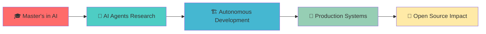

# 🚀 Pratik Nichite

<div align="center">
  
[](https://github.com/PratikNichite)
[](https://maps.google.com/?q=Würzburg,Germany)
[](mailto:your-email@example.com)

</div>

<div align="center">
  
</div>

---

## 🎯 About Me

> **AI Researcher & Software Engineer** with 3+ years of experience in advanced AI/ML technologies. Currently collaborating with **Databricks** on [app.build](https://www.app.build/) - an open-source AI agent for autonomous full-stack development.

```python
class PratikNichite:
    def __init__(self):
        self.name = "Pratik Nichite"
        self.location = "Würzburg, Germany"
        self.education = "M.S. Artificial Intelligence (In Progress)"
        self.specialization = [
            "Natural Language Processing",
            "Computer Vision", 
            "Generative AI",
            "Autonomous Systems",
            "Time Series Forecasting"
        ]
        self.current_focus = "AI Agents & Autonomous Development"
        
    def get_passion(self):
        return "Building AI systems that solve real-world problems"
```

---

## 🛠️ Tech Arsenal

<div align="center">

### 🧠 AI & Machine Learning


### 🤖 AI Agents & LLMs


### 💻 Development & Deployment


</div>

---

## 🎓 Education & Background

<table>
<tr>
<td width="50%">

### 🎓 Master in Artificial Intelligence
**Technical University Würzburg-Schweinfurt**  
📅 March 2023 – Present  
📍 Würzburg, Germany

</td>
<td width="50%">

### 🎓 Bachelor in Computer Engineering
**Savitribai Phule Pune University**  
📅 July 2018 – August 2022  
📍 Pune, India

</td>
</tr>
</table>

---

## 🚀 Featured Projects

<div align="center">

### 🤖 **AI Agent for Portfolio Data Retrieval**
*Advanced LLM-powered autonomous system*

[](https://github.com/PratikNichite/portfolio_assistant_backend)


</div>

<details>
<summary><b>🔍 Click to expand more projects</b></summary>

### 📊 **App.Build Evaluation with Databricks**
- **Partnership**: Collaborating with Databricks team
- **Focus**: End-to-end fullstack application development evaluation
- **Impact**: Identifying improvement opportunities for complex workflows
- [](https://github.com/keugenek/app.build-eval-docs/tree/feat/types-off-analysis-and-recommendation)

### 📚 **SPIDER - Scientific Publication Resource**
- **Achievement**: 90% precision, 80% recall
- **Tech**: Self-hosted LLMs (Mistral, Phi3), Fine-tuning
- **Publication**: IEEE Conference Paper (2024)
- [](https://github.com/Sah-Pranav/SPIDER)

### 📝 **BART Dialogue Summarization**
- **Performance**: Outperformed T5, Pegasus baselines
- **Deployment**: Hugging Face Hub with API integration
- [](https://github.com/PratikNichite/Semantics_Group_Tasks/tree/main/Capstone_Project)

### 🏗️ **Infrastructure Anomaly Detection**
- **Method**: Variational Autoencoder (VAE)
- **Achievement**: 96.1% F1-score on crack detection
- [](https://github.com/PratikNichite/Anomaly-Detection-for-Infrastructure-Monitoring)

</details>

---

## 📈 GitHub Analytics

<div align="center">
  
  
</div>

<div align="center">
  
</div>

---

## 📄 Publications & Research

### 📑 Recent Publications

<table>
<tr>
<td>

**🔬 Scientific Publication Indexing and Definition Extraction Resource**  
*IEEE ITHET Conference 2024, Paris*  
[](https://doi.org/10.1109/ITHET61869.2024.10837640)

</td>
</tr>
<tr>
<td>

**🚗 Driver's Drowsiness Detection Using Facial Features**  
*Journal of Emerging Technologies, 2022*  


</td>
</tr>
</table>

---

## 🌐 Professional Network

<div align="center">

[](https://linkedin.com/in/pratik-nichite)
[](https://github.com/PratikNichite)
[](mailto:your-email@example.com)

</div>

---

## 🎯 Current Focus



<div align="center">

### 🎯 **Currently Working On**
- 🤖 **AI Agent Research** with Databricks team
- 🎓 **Master's Thesis** in Autonomous Systems
- 🌍 **Open Source Contributions** to AI community
- 📚 **Continuous Learning** in cutting-edge AI technologies

</div>

---

## 🏆 Key Achievements

<div align="center">

| 🎯 Achievement | 📊 Metric | 🔧 Technology |
|----------------|-----------|---------------|
| 🎯 Scientific Term Extraction | 90% Precision, 80% Recall | Self-hosted LLMs |
| 🏗️ Infrastructure Anomaly Detection | 96.1% F1-Score | VAE, Computer Vision |
| 🎭 Movement Classification | 87% Accuracy | LSTM, OpenPose |
| 🏭 Toy Quality Control | 99% Precision | YOLOv8, Transfer Learning |

</div>

---

## 🌍 Languages

<div align="center">

| Language | Level | Certification |
|----------|-------|---------------|
| 🇮🇳 **Marathi** | Native | Mother Tongue |
| 🇮🇳 **Hindi** | Fluent | Native Proficiency |
| 🇺🇸 **English** | B2 | IELTS Certified |
| 🇩🇪 **German** | B1 | Academic Level |

</div>

---

## 📫 Get In Touch

<div align="center">

*"Building AI systems that bridge research and real-world impact"*

[](mailto:your-email@example.com)

</div>

---

<div align="center">
  
</div>

<div align="center">
  <sub>🌟 <strong>Made with ❤️ and lots of ☕</strong> 🌟</sub>
</div>
